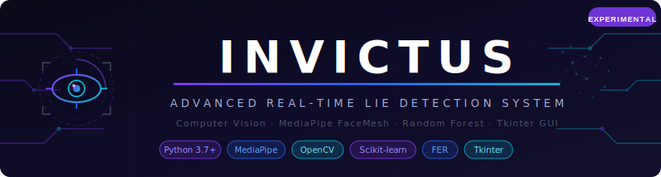
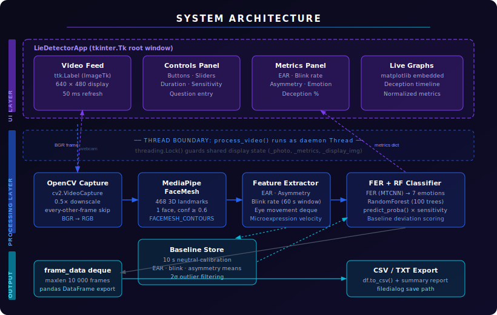
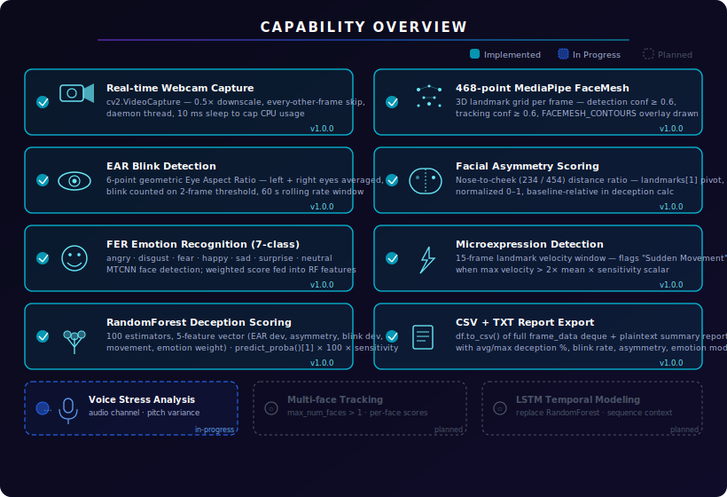
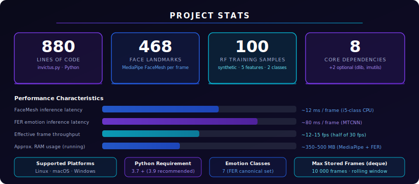

<div align="center">



</div>

**Your webcam is now a polygraph. A deeply experimental, caveat-laden polygraph that also exports CSV.**

[Features](#features) • [Installation](#installation) • [Usage](#usage) • [Architecture](#architecture) • [Roadmap](#roadmap) • [License](#license)

---

*I built this because I kept reading research papers about facial deception cues and thinking "someone should just wire all of this together and see what happens." So I did. No cloud, no API key, no subscription, no magic — just 468 facial landmarks, a Random Forest, and whatever neutral expression you can hold for 10 seconds.*

**Invictus** is a desktop lie detection system that runs entirely on your local machine. It uses MediaPipe FaceMesh to extract 468 3D facial landmarks per frame, computes Eye Aspect Ratio, facial asymmetry, blink rate, microexpression velocity, and FER-classified emotion, then feeds five baseline-relative deviation features into a RandomForestClassifier that outputs a deception probability. The whole thing lives in a Tkinter GUI with embedded matplotlib charts, a progress bar, and a results panel that politely reminds you the output is experimental every time you try to use it for something it's not meant for.

---

<div align="center">

[](https://python.org)
[](https://opencv.org)
[](https://mediapipe.dev)
[](https://scikit-learn.org)
[]()
[](LICENSE)
[]()

</div>

---

## System Overview

Invictus is a single-file Python application split across two classes: `LieDetectorApp` handles the Tkinter GUI and threading lifecycle, while `EnhancedLieDetector` handles all the computer vision and ML inference. A background daemon thread runs the video capture loop; the GUI thread updates every 50 ms via Tkinter's `after()` callback. A `threading.Lock` guards all shared state between them. This structure keeps the GUI responsive without any async framework — just plain threads and careful locking.

```
invictus/
├── invictus.py                            # Entire application: GUI + detection engine
├── requirements.txt                       # pip dependencies
├── shape_predictor_68_face_landmarks.dat  # Pre-trained dlib model (optional)
├── banner.svg                             # Legacy banner asset
├── assets/                                # Generated SVG documentation assets
│   ├── hero-banner.svg
│   ├── architecture.svg
│   ├── data-flow.svg
│   ├── capabilities.svg
│   └── stats.svg
├── wiki/                                  # Extended documentation
│   ├── Home.md
│   ├── Architecture.md
│   ├── Installation.md
│   ├── Usage.md
│   ├── Privacy.md
│   ├── Roadmap.md
│   └── Troubleshooting.md
├── CONTRIBUTING.md
├── SECURITY.md
├── CHANGELOG.md
└── LICENSE
```

<div align="center">



</div>

---

## Features

| Feature | What it actually does |
|---|---|
| 🎥 **Real-time webcam capture** | `cv2.VideoCapture` on a daemon thread — skips odd frames and downscales to 0.5× to keep CPU usage tolerable on non-gaming hardware |
| 👁️ **Eye Aspect Ratio (EAR)** | Computes the 6-point Soukupová formula for both eyes independently, averages them, and uses 70% of baseline EAR as the blink threshold |
| 💡 **Blink rate tracking** | Edge-triggered counter (fires once per close-open cycle, not continuously) — rate is blinks in the trailing 60-second window |
| 📐 **Facial asymmetry scoring** | Computes the relative distance difference from nose tip (landmark 1) to left cheek (234) vs. right cheek (454), normalized 0–1 |
| ⚡ **Microexpression detection** | Sums displacement across all 468 landmarks between consecutive frames; flags "Sudden Movement" when any frame exceeds `2 × mean_velocity × sensitivity` |
| �� **FER emotion recognition** | MTCNN-backed FER library classifies 7 emotions per frame; each emotion has a signed weight that contributes to the deception feature vector |
| 🤖 **RandomForest deception score** | 100-estimator classifier trained on 5 baseline-relative features; outputs `predict_proba()[1] × 100 × sensitivity`, clamped to [0, 100]% |
| ⚙️ **Personal baseline calibration** | 10-second neutral recording at session start; outlier-filtered (2σ) means become the reference for all subsequent deviation calculations |
| 📊 **Live matplotlib dashboards** | Two embedded charts update during analysis: deception probability over time + normalized EAR / asymmetry / blink rate on the same axis |
| 💾 **CSV + text export** | `df.to_csv()` of every frame's metrics dict, plus a plaintext summary report with per-metric aggregates |
| 🎛️ **Sensitivity slider** | Scales the final deception probability output from 0.1× to 1.0× — a blunt but accessible way to tune for different lighting and face types |
| 🔒 **Thread-safe GUI** | `threading.Lock` guards `_photo`, `_metrics`, and `_display_img`; all GUI mutations go through Tkinter's `after()` |

---

## Capability Visualization

<div align="center">



</div>

---

## Architecture

<div align="center">


</div>

The application uses a two-thread model: the main thread owns the Tkinter event loop and the matplotlib canvas; a single daemon thread owns `cv2.VideoCapture`, `mp.solutions.face_mesh`, and the FER detector. The daemon thread writes processed frames and metric dicts to shared variables under `self._lock`; the GUI thread reads them in a 50 ms polling loop. This avoids the complexity of a message queue while keeping the GUI from blocking on frame inference.

The design deliberately keeps `LieDetectorApp` and `EnhancedLieDetector` fully decoupled — the GUI knows nothing about landmark indices or blink thresholds, and the detector knows nothing about widgets. This matters because the detector's `process_frame()` method could be dropped into a headless script or a different GUI toolkit without any changes. The baseline calibration is stored as a plain dict in the detector instance, not in the GUI, so it survives stop/start cycles within a session.

---

## Data Flow

<div align="center">


</div>

Primary data path from webcam to deception score:

```
Webcam (BGR)
  └─► cv2.VideoCapture  →  0.5× resize  →  skip odd frames
        └─► MediaPipe FaceMesh  →  468 (x, y, z) landmarks
              └─► extract_metrics()
                    ├─ EAR (left + right, 6 pts each)
                    ├─ Facial asymmetry (nose→cheek dist ratio)
                    ├─ Blink rate (60 s rolling window)
                    ├─ Eye movement (deque of center positions)
                    ├─ Microexpression (velocity > 2× mean × sens)
                    └─ FER emotion  →  emotion_weight scalar
                          └─► [ear_dev, asym_score, blink_dev,
                                movement_score, emotion_score]
                                  └─► RandomForest.predict_proba()
                                        └─► deception_probability (0–100 %)
                                              ├─► GUI metrics labels
                                              ├─► matplotlib charts
                                              └─► frame_data deque  →  CSV / TXT
```

---

## Installation

### 1. Clone the repository

```bash
git clone https://github.com/Kaelith69/invictus.git
cd invictus
```

### 2. Create a virtual environment

Always use a virtualenv — FER, MediaPipe, and dlib all have native components that don't play well if they're installed globally and then conflict with each other.

```bash
# Linux / macOS
python3 -m venv venv
source venv/bin/activate

# Windows
python -m venv venv
venv\Scripts\activate
```

### 3. Install dependencies

```bash
pip install -r requirements.txt
```

**Why each dependency is there:**

| Package | Why it's needed |
|---|---|
| `opencv-python` | Opens the webcam, reads BGR frames, resizes them, and draws landmark overlays on the display copy |
| `mediapipe` | Runs on-device FaceMesh — 468 3D landmarks per frame without a server call |
| `numpy` | EAR formula, distance calculations, feature vector assembly |
| `pillow` | Converts OpenCV BGR arrays to `ImageTk.PhotoImage` objects that Tkinter can actually display |
| `pandas` | Collects per-frame dicts into a DataFrame for analysis and CSV export |
| `matplotlib` | The two live charts embedded in the right panel are Matplotlib figures on a `FigureCanvasTkAgg` |
| `scikit-learn` | Provides `RandomForestClassifier` and `predict_proba()` |
| `fer` | MTCNN-backed deep learning model for 7-class facial emotion recognition |

### 4. Platform-specific notes

| Platform | Extra step |
|---|---|
| **Linux** | `sudo apt-get install python3-tk cmake build-essential` (Tkinter + dlib build deps) |
| **macOS** | Install Xcode command line tools: `xcode-select --install` (needed if using dlib) |
| **Windows** | No extras needed for the core stack; dlib requires a Visual Studio C++ build environment |

> **Pro tip:** dlib (`shape_predictor_68_face_landmarks.dat`) is optional — the primary landmark pipeline uses MediaPipe. Skip dlib entirely unless you specifically need the 68-point model. Your compile time will thank you.

### 5. Run the application

```bash
python invictus.py
```

---

## Usage

1. **Launch and accept the disclaimer.** It pops up immediately. Click OK. The disclaimer is accurate: this tool produces experimental output and should not be used in any context where the result matters.

2. **Click "Start Camera".** The left panel shows the live webcam feed with landmark overlays. Make sure your face is fully visible, you're 40–80 cm from the camera, and the lighting is even — no strong backlight, no shadows across your face.

3. **Click "Capture Baseline".** Maintain a **completely neutral expression** for 10 seconds while the progress bar fills. The baseline records your personal resting EAR, facial asymmetry, and blink rate. Every subsequent deception score is a deviation from this — a bad baseline produces bad scores for the entire session.

4. **Set your parameters.** In the Settings panel: recording duration (5–300 s, default 30), sensitivity (0.1–1.0, default 0.7), and an optional question to display during analysis.

5. **Click "Start Analysis".** Real-time metrics populate the right panel. The top chart shows deception probability over time; the bottom chart shows normalized EAR, asymmetry, and blink rate on the same axis.

6. **Click "Stop" or let the timer expire.** The Results panel shows aggregated statistics: average and peak deception %, average blink rate, average EAR, average asymmetry, dominant emotion, and microexpression event count.

7. **Click "Save Results"** to export `<name>.csv` (full per-frame data) and `<name>_report.txt` (plaintext summary) to a path you choose via the file dialog.

> **Pro tip:** Run a couple of test sessions without any "analysis intent" first — just talk naturally to calibrate your sense of what your own scores look like at baseline deviation 0. The absolute numbers are less meaningful than the relative change between truthful and potentially deceptive responses.

---

## Project Structure

```
invictus/
│
├── 🐍 invictus.py                           # The whole application in one file
│   ├── class LieDetectorApp                 #   Tkinter GUI, threading lifecycle,
│   │   ├── setup_ui()                       #   widget construction (panels, buttons,
│   │   ├── start_camera()                   #   sliders, progress bar, graphs)
│   │   ├── process_video()                  #   daemon thread: capture → detect → store
│   │   ├── update_gui()                     #   50 ms Tkinter after() loop
│   │   ├── capture_baseline()               #   10 s neutral recording
│   │   ├── start_analysis()                 #   kicks off timed recording
│   │   ├── analyze_results()                #   post-session summary
│   │   └── save_results()                   #   CSV + TXT export
│   │
│   └── class EnhancedLieDetector            #   CV + ML engine (no GUI imports)
│       ├── process_frame()                  #   single frame → (annotated_frame, metrics)
│       ├── extract_metrics()                #   landmarks → EAR, asymmetry, blink, movement
│       ├── calculate_eye_aspect_ratio()     #   6-point EAR formula
│       ├── calculate_blink_rate()           #   60 s rolling window
│       ├── calculate_facial_asymmetry()     #   nose-to-cheek normalized ratio
│       ├── detect_microexpression()         #   velocity threshold over 15-frame window
│       ├── detect_emotion()                 #   FER MTCNN → dominant emotion + score
│       ├── calculate_deception_probability()#   5-feature RF predict_proba()
│       └── set_baseline()                   #   2σ outlier-filtered calibration
│
├── 📄 requirements.txt                      # pip dependencies (8 core + 2 optional)
├── 🗂️ shape_predictor_68_face_landmarks.dat # Pre-trained dlib 68-point model (optional)
├── 🖼️ banner.svg                            # Legacy banner (superseded by assets/)
│
├── 📁 assets/                               # SVG documentation assets
│   ├── hero-banner.svg
│   ├── architecture.svg
│   ├── data-flow.svg
│   ├── capabilities.svg
│   └── stats.svg
│
├── 📁 wiki/                                 # Extended documentation pages
│   ├── Home.md
│   ├── Architecture.md
│   ├── Installation.md
│   ├── Usage.md
│   ├── Privacy.md
│   ├── Roadmap.md
│   └── Troubleshooting.md
│
├── 📋 CONTRIBUTING.md
├── 🔐 SECURITY.md
├── 📝 CHANGELOG.md
└── ⚖️ LICENSE
```

---

## Performance Stats

<div align="center">



</div>

---

## Privacy

**What Invictus does with your data:**

- Webcam frames are processed in memory and discarded. The `frame_data` deque has a hard cap of 10,000 entries; older entries are automatically evicted. Nothing is written to disk unless you click "Save Results".
- No network calls. No telemetry. No crash reporting. The application has no concept of the internet.
- When you do save results, the exported CSV contains per-frame biometric metrics (EAR values, asymmetry scores, blink rates, emotion labels, deception probabilities). These are biometric data. Store, share, and delete them accordingly.
- Invictus has not been validated for use under GDPR, CCPA, BIPA, or any other privacy regulation governing biometric data collection. If you're using it for anything other than personal experimentation, you are responsible for your own compliance.

---

## Roadmap

### ML & Accuracy
- [ ] Replace synthetic RandomForest training data with an ethically sourced, real-world dataset
- [ ] Add LSTM temporal modeling to capture sequence context across frames
- [ ] Implement optical flow microexpression detection to replace the velocity heuristic
- [ ] Per-model validation metrics and accuracy reporting in the GUI

### Inputs & Modalities
- [ ] Audio channel — voice stress analysis (pitch variance, speech rate) as a parallel detection stream
- [ ] Support for pre-recorded video file analysis (not just live webcam)
- [ ] Multi-face tracking — `max_num_faces > 1` with per-face deception scores

### Architecture & Code Quality
- [ ] Add unit tests for `EnhancedLieDetector` methods (EAR, asymmetry, blink rate)
- [ ] Plugin architecture for swappable ML backends (RF, LSTM, custom)
- [ ] Replace `warnings.filterwarnings("ignore")` with targeted suppression

### UX & Distribution
- [ ] Standalone packaged executable (`.exe` / `.app`) via PyInstaller
- [ ] Dark mode GUI option
- [ ] Configurable emotion weight presets

---

## Packaging

To build a standalone executable with PyInstaller (creates a single-file binary with all dependencies):

```bash
pip install pyinstaller
pyinstaller --onefile --windowed invictus.py
```

The output binary appears in `dist/invictus`. On Windows add `--icon=assets/hero-banner.svg` (converted to `.ico` first). The `shape_predictor_68_face_landmarks.dat` file must be bundled separately or distributed alongside the binary if dlib integration is used.

---

## Contributing

Contributions welcome. See [CONTRIBUTING.md](CONTRIBUTING.md) for branch naming, commit style, and pull request expectations. High-value areas: replacing the synthetic training data, optical flow microexpression detection, and LSTM temporal modeling.

---

## Security

For vulnerability disclosure, see [SECURITY.md](SECURITY.md).

---

## License

MIT License. See [LICENSE](LICENSE) for full text.

Built by [Kaelith69](https://github.com/Kaelith69) — use it for research, not interrogations.

---

<div align="center">
  <sub>⚠️ This is an experimental research tool. Lie detection via facial analysis is not scientifically validated and must not be used in legal, professional, or high-stakes contexts.</sub>
</div>
